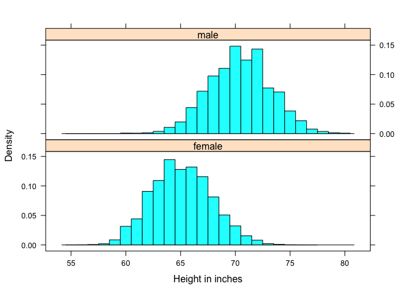
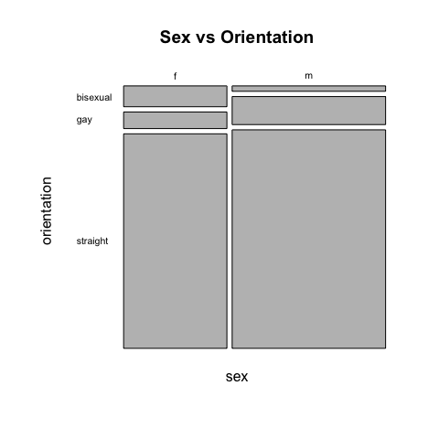
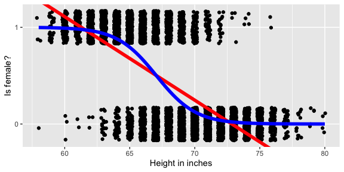
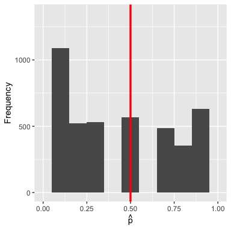

OkCupid Profile Data for Intro Stats and Data Science Courses (Revised
in 2021)
================
Albert Y. Kim and Adriana Escobedo-Land

Data and code for [OkCupid Profile Data for Introductory Statistics and
Data Science
Courses](https://www.tandfonline.com/doi/abs/10.1080/10691898.2015.11889737),
Journal of Statistics Education July 2015, Volume 23, Number 2. **The
original manuscript was subsequently revised in 2021.**

  - `JSE_revised.Rnw`: `.Rnw` source document to recreate
    `JSE_revised.pdf` using `knitr`. In RStudio, go to “Tools” -\>
    “Project Options” -\> “Sweave” -\> “Weave Rnw files using:” and
    select knitr.  
  - `JSE_revised.pdf`: PDF of document
  - `JSE_revised.bib`: bibliography file
  - `JSE_revised.R`: R code used in document
  - `okcupid_codebook_revised.txt`: codebook for all variables
  - `profiles_revised.csv.zip`: CSV file of revised profile data (unzip
    this first)
  - `essays_revised_and_shuffled.zip`: CSV file of shuffled essay data
    (unzip this first)

## Notes

  - **Revisions in 2021**:
      - Removed the exact date the data was collected.
      - Shuffled/randomized the order of the rows of the essay data,
        thereby decoupling the essay data from the profiles data.
      - Removed URL’s in the essay data that involved the following
        domains: facebook.com, instagram.com, twitter.com,
        pinterest.com, and flickr.com.
      - Added random noise to age variable in the profiles data.
      - Removed the following variables from the profiles data:
        location, last online
  - **Original version from 2015**:
      - Permission to use this data set was explicitly granted by
        OkCupid.
      - Usernames are not included.

## Preview

### Distribution of Male and Female Heights

<!-- -->

### Joint Distribution of Sex and Sexual Orientation

A mosaicplot of the cross-classification of the 59946 users’ selected
sex and sexual orientation:

<!-- -->

### Logistic Regression to Predict Sex

Linear regression (in red) and logistic regression (in blue) compared.
Note both the x-axis (height) and y-axis (is female: 1 if user is
female, 0 if user is male) have random jitter added to better visualize
the number of points involved for each (height x sex) pair.

<!-- -->

Fitted probabilities p-hat of each user being female along witha
decision threshold (in red) used to predict if user is female or not.

<!-- -->
